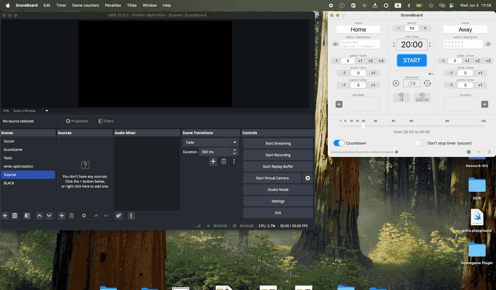

# List of tutorials for Scoreboard using OBS as an example
- [Getting Started](#getting-started)
- [How to add a text in OBS to read a local TXT file](#how-to-add-a-text-in-obs-to-read-a-local-txt-file)

---

## Getting Started

**Scoreboard for OBS on macOS** is a user-friendly app designed for sports enthusiasts, broadcasters, and streamers who want to display live score updates in their OBS Studio scenes for two teams/players. This lightweight application simplifies the process of managing and integrating a scoreboard, allowing you to focus on the game and your audience.

**Enhance your sports broadcasts with Scoreboard for OBS on macOS — simple, effective, and designed for live streaming!**

## Ideal Use Cases  

- Sports events (football, basketball, volleyball, etc.)  
- eSports and gaming tournaments  
- Live commentary and analysis streams  

## Features  

- **Live Score Updates:** Easily update scores in real-time during a game or match.  
- **Text File Integration:** Automatically generates and updates a `.txt` file with the scoreboard information, making it compatible with OBS Studio's *Text (FreeType 2)* source.  
- **Minimal Resource Usage:** The app is optimized for macOS, ensuring smooth performance even on resource-constrained systems.  
- **Intuitive Interface:** Simple and clean interface for managing teams, scores, and other match details.
- **Customizable Layout:** Tailor the scoreboard’s appearance to match your stream’s style, including font size, color, and positioning. This can be done in a streamer program, for example in OBS.  

## How It Works  

1. **Set Up the App**  
   - Install the app on your macOS device [Mac App Store](https://apps.apple.com/us/app/scoreboard-for-obs-broadcasts/id1579159150?mt=12).  
   - Open the app and configure your teams/players names, and other initial settings.  

2. **Update Scores in Real-Time**  
   - Adjust team scores using the app's user-friendly controls.  
   - The app automatically saves the updated scores to a `.txt` files. Default directory `Downloads - ScoreBoard Outputs` 

3. **Integrate with OBS Studio**  
   - In OBS, create a new *Text (FreeType 2)* source or drag and drop the desired text file into OBS.  
   - Enable the "Read from File" option and select the `.txt` file generated by the app.  
   - Customize the created text source in OBS: position, size, font, color, etc.  

4. **Stream or Record**  
   - As you update scores in the Scoreboard app, the changes are reflected in OBS in real-time. OBS will automatically read the files from the disk (approximately once per second) and display the result.  

---

## How to add a text in OBS to read a local TXT file

### 1. Open OBS Studio  
Launch OBS Studio on your computer.

### 2. Create a New Scene (Optional)  
If you want to organize your setup, create a new scene:  
- Click the **+** button in the **Scenes** section.  
- Give your scene a name and save it.

### 3. Add a Text Source  
- In the **Sources** section, click the **+** button.  
- Select **Text (FreeType 2)** from the list.  
*Or simply drag the desired text file from Finder into the OBS window.*

### 4. Name Your Text Source  
- Enter a descriptive name for the source (e.g., `Main Timer`).  
- Click **OK** to create the source.

### 5. Enable Reading from File  
- In the text source properties window, check the box labeled **Read from File**.  
- This will allow the text to be dynamically updated from a TXT file.

### 6. Select Your TXT File  
- Click the **Browse** button next to the file path field.  
- Navigate to your local TXT file, select it, and click **Open**.

### 7. Customize Appearance  
- Use the **Font**, **Size**, and **Color** options to adjust the text style.  
- Experiment with alignment, gradient, and background settings to fit your layout.

### 8. Place the Text on the Canvas  
- Drag the text box in the preview area to position it on your scene.  
- Resize it as necessary.

### 9. Test File Updates  
- Change the value of the counter in ScoreBoard, for example, start a timer.  
- Verify that the changes appear in OBS in real-time.

---
